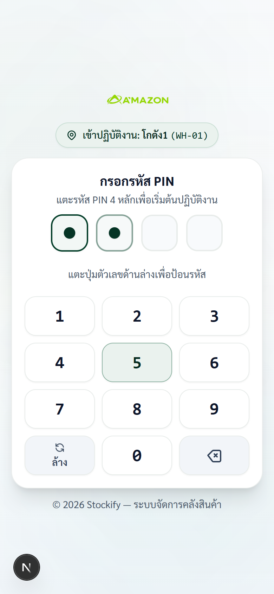
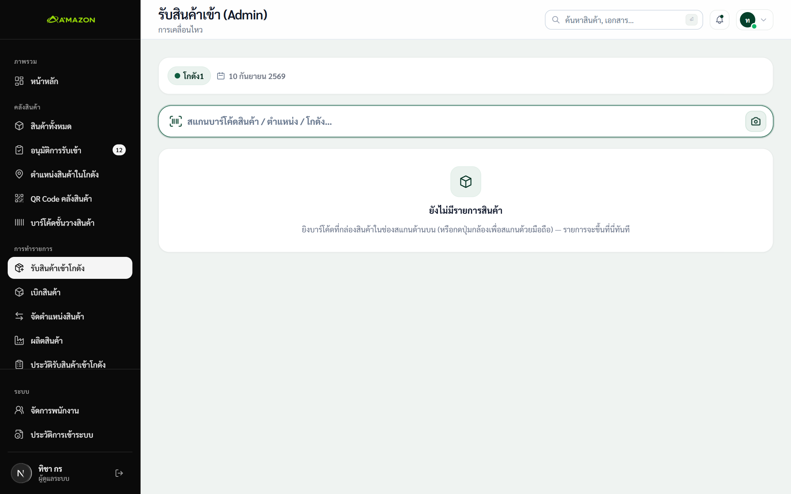
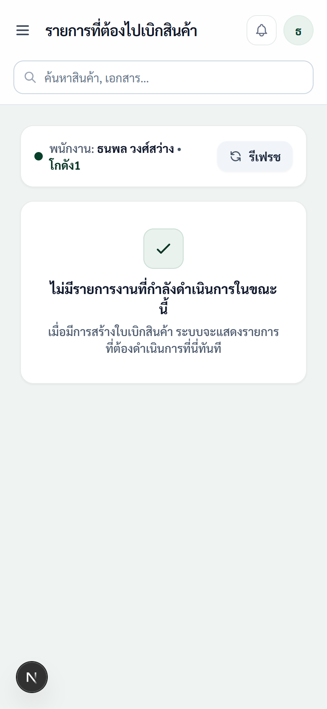
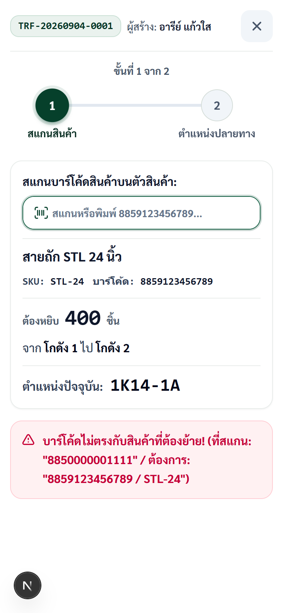
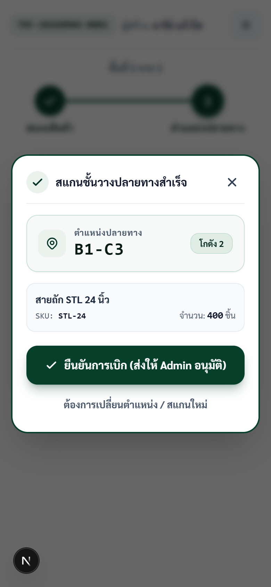
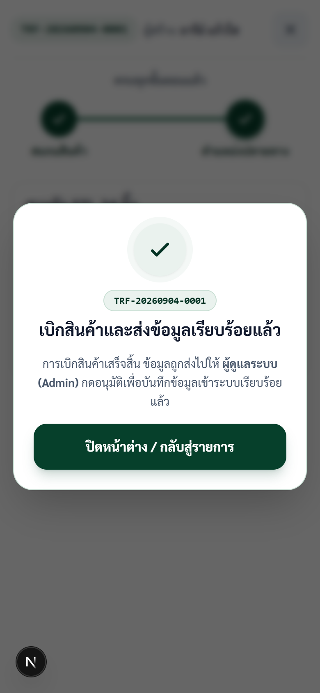

# คู่มือปฏิบัติการคลังหน้างาน (Warehouse Staff Handbook)
### สำหรับพนักงานคลังสินค้าหน้างาน (Mobile & Barcode Terminal)

> **คู่มือฉบับนี้จัดทำขึ้นสำหรับ:** พนักงานคลังที่ปฏิบัติงานจริงใน สำนักงานใหญ่ และโกดัง 1 ถึง 5  
> **อุปกรณ์ที่ใช้งาน:** สมาร์ทโฟน (Android / iOS) หรือ เครื่องอ่านบาร์โค้ดพกพา (PDA Barcode Scanner)  
> **ภาพประกอบ:** ภาพถ่ายหน้าจอจริงจากการทำงานในระบบ Stockify

---

## 1. การเข้าสู่ระบบด้วย QR Code และ PIN 4 หลัก

  
  
<em>ภาพที่ 1: หน้าจอจริงในการกรอกรหัส PIN 4 หลัก พร้อมป้ายระบุโกดังที่กำลังทำงาน</em>

### ขั้นตอนการทำ:
1. เดินไปที่หน้าประตูโกดัง แล้วใช้กล้องมือถือสแกน **ป้าย QR Code ประจำโกดัง**
2. หน้าจอมือถือจะเปิดหน้าเข้าสู่ระบบ พร้อมแถบสีเขียวระบุโกดัง เช่น `📍 เข้าปฏิบัติงาน: โกดัง 1 (WH-01)`
3. แตะแป้นตัวเลขบนหน้าจอเพื่อใส่ **รหัส PIN ประจำตัว 4 หลัก**
4. เมื่อกดครบ 4 หลัก ระบบจะเข้าสู่หน้าจอการทำงานของโกดังนั้นทันที

> [!WARNING]
> ห้ามให้รหัส PIN กับผู้อื่น และหากกด PIN ผิดติดต่อกันครบ **5 ครั้ง** ระบบจะล็อกหน้าจอเป็นเวลา 5 นาทีทันที

---

## 2. งานที่ 1: รับสินค้าเข้าโกดัง (Receive - RCV)

*ภาพที่ 2: หน้าจอการสแกนรับสินค้าเข้าโกดัง ระบุกล่อง/ชิ้น และชั้นวาง*

### ขั้นตอนการทำ:
1. กดเลือกเมนู **"รับสินค้าเข้าโกดัง"**
2. **สแกนบาร์โค้ดสินค้า:**
   - ชี้เครื่องยิงไปที่บาร์โค้ดบนกล่องสินค้า หรือกดปุ่มไอคอน **[ 📷 กล้อง ]** เพื่อใช้กล้องมือถือสแกน
   - เมื่อสแกนติด รายการสินค้าจะปรากฏขึ้นในการ์ดรับเข้าทันที
3. **ระบุจำนวนและที่วาง:**
   - กรอก **จำนวนกล่อง** และ **จำนวนชิ้นรวม** ที่นับได้จริง
   - ในช่อง **ตำแหน่งจัดเก็บ** ให้สแกนบาร์โค้ดที่ติดอยู่ที่ชั้นวาง (หรือแตะเลือก เช่น `1K14-1A`)
   - หากสินค้านี้ต้องแยกเก็บ 2 ชั้น ให้กดปุ่ม **[ + เพิ่มตำแหน่ง ]**
4. กดปุ่มสีเขียวเข้ม **[ ✓ ยืนยันรายการนี้ ]** (รายการจะพับเก็บลงด้านล่าง)
5. สแกนกล่องต่อไปเรื่อยๆ จนครบ
6. เมื่อครบทุกรายการแล้ว ให้กดปุ่ม **[ ตรวจสอบและบันทึกการรับเข้า ]** แล้วกดยืนยันเพื่อส่งให้หัวหน้าคลังอนุมัติ

---

## 3. งานที่ 2: หยิบและเบิกสินค้าตามใบสั่ง (Transfer - TRF)

  
  
<em>ภาพที่ 3.1: รายการแจ้งเตือนงานที่ต้องไปเบิกในโกดังของท่าน</em>

1. เข้าเมนู **"เบิกสินค้า"** จะเห็นรายการแจ้งเตือนในกล่อง **"รายการที่ต้องไปเบิกสินค้า"**
2. กดปุ่มสีเขียว **[ เริ่มเบิกสินค้า / สแกน ➔ ]**

  
  
<em>ภาพที่ 3.2: ขั้นที่ 1 — สแกนบาร์โค้ดบนตัวสินค้าเพื่อยืนยัน</em>

3. **ขั้นที่ 1 — สแกนยืนยันสินค้า:**
   - เดินไปยังพิกัดชั้นวางที่หน้าจอระบุ (เช่น `1K14-1A`)
   - หยิบสินค้าขึ้นมาแล้วสแกนบาร์โค้ดบนตัวสินค้า
   - หากสแกนผิดกล่อง ระบบจะขึ้นแถบสีแดงเตือนทันที: *"บาร์โค้ดไม่ตรงกับสินค้าที่ต้องย้าย!"*
   - เมื่อสแกนถูกต้อง ระบบจะติ๊กถูกสีเขียวและเปิดให้ไปต่อ

  
  
<em>ภาพที่ 3.3: ขั้นที่ 2 — สแกนพิกัดชั้นวางปลายทาง</em>

4. **ขั้นที่ 2 — สแกนตำแหน่งปลายทาง:**
   - นำสินค้าไปส่งที่โกดังปลายทาง แล้วสแกนบาร์โค้ดชั้นวางปลายทาง (เช่น `B1-C3`)
   - กดปุ่ม **[ ✓ ยืนยันการเบิก (ส่งให้ Admin อนุมัติ) ]**

  
  
<em>ภาพที่ 3.4: หน้าจอแจ้งเตือนส่งงานสำเร็จและออกเลขที่ TRF เรียบร้อย</em>

5. ระบบจะแสดงหน้าจอความสำเร็จพร้อมระบุเลขที่เอกสาร **`TRF-...`**

---

## 4. งานที่ 3: จัดย้ายตำแหน่งสินค้าภายในคลัง (Move Location - MOV)

  
  
<em>ภาพที่ 4: หน้าจอจัดย้ายตำแหน่งสินค้าภายในโกดัง</em>

ใช้เมื่อต้องการจัดระเบียบสินค้า หรือย้ายกล่องสินค้าจากชั้นวางเดิมไปยังชั้นวางใหม่:
1. เข้าเมนู **"ย้ายตำแหน่งสินค้า"**
2. **สแกนสินค้า:** สแกนบาร์โค้ดสินค้าที่ต้องการย้าย และระบุพิกัดชั้นวางต้นทางที่หยิบออกมา
3. **สแกนตำแหน่งใหม่:** เดินไปที่ชั้นวางใหม่ แล้วสแกนบาร์โค้ดป้ายชั้นวางปลายทาง
4. **ระบุจำนวน:** ใส่จำนวนชิ้นที่ย้าย แล้วกดปุ่ม **[ ยืนยันการจัดย้ายตำแหน่ง ]**
   - พิกัดในระบบจะอัปเดตเป็นชั้นวางใหม่ทันที

---

## 5. งานที่ 4: ค้นหาสินค้าและเช็กพิกัดชั้นวาง

*ภาพที่ 5: หน้าจอค้นหาสินค้าและเช็กพิกัดชั้นวาง*

- เข้าเมนู **"สินค้าทั้งหมด"**
- พิมพ์ชื่อสินค้า หรือรหัส SKU หรือสแกนบาร์โค้ดลงในช่องค้นหา
- ดูที่ช่อง **"ตำแหน่งจัดเก็บ"** เพื่อดูว่าสินค้าชิ้นนั้นเก็บอยู่ที่โกดังใด ชั้นวางใด

---

## 6. ข้อควรระวังและวิธีแก้ปัญหาหน้างาน

1. **สแกนบาร์โค้ดไม่ติด:** ตรวจสอบเลนส์กล้องมือถือให้สะอาด หรือพิมพ์ตัวเลขบาร์โค้ดลงในช่องค้นหาด้วยมือ
2. **ระบบเตือนบาร์โค้ดไม่ตรง:** ให้เทียบชื่อสินค้าบนหน้าจอกับกล่องสินค้าจริงทันที ห้ามฝืนกดยืนยัน
3. **ใส่ PIN ผิดครบ 5 ครั้ง:** ระบบจะล็อกหน้าจอ 5 นาที ให้รอเวลาครบหรือแจ้งหัวหน้าคลังเพื่อรีเซ็ต PIN
