# คู่มือสำหรับผู้ดูแลระบบและผู้จัดการคลัง (Admin & Manager Guide)
### ระบบบริหารจัดการคลังสินค้า Stockify (ฉบับครบทุกเมนู พร้อมภาพหน้าจอจริง 100%)

> **สำหรับบทบาท:** ผู้ดูแลระบบ (ADMIN) และ ผู้จัดการคลังสินค้า (MANAGER)  
> **อุปกรณ์:** คอมพิวเตอร์เดสก์ท็อป / แล็ปท็อป (ผ่าน Google Chrome / Microsoft Edge)  
> **ภาพประกอบ:** ภาพถ่ายหน้าจอจริงจากระบบ Stockify ทุกเมนู

---

## 1. การเข้าสู่ระบบผู้ดูแลระบบ (Sign In)

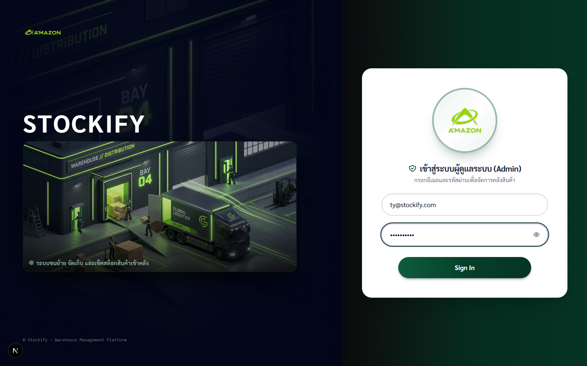
*ภาพที่ 1: หน้าจอ Sign In ของผู้ดูแลระบบและฝ่ายจัดการ*

- เปิดเว็บบราวเซอร์ Google Chrome เข้าสู่หน้าเข้าใช้งานระบบ Stockify
- กรอก **ชื่อผู้ใช้งาน / อีเมล (Username / Email)** และ **รหัสผ่าน (Password)** ของผู้ดูแลระบบ
- คลิกปุ่ม **[ Sign In ]** เพื่อเข้าสู่ระบบ

---

## 2. [เมนูที่ 1] หน้าแดชบอร์ดภาพรวมระบบ (Admin Dashboard - `/dashboard`)

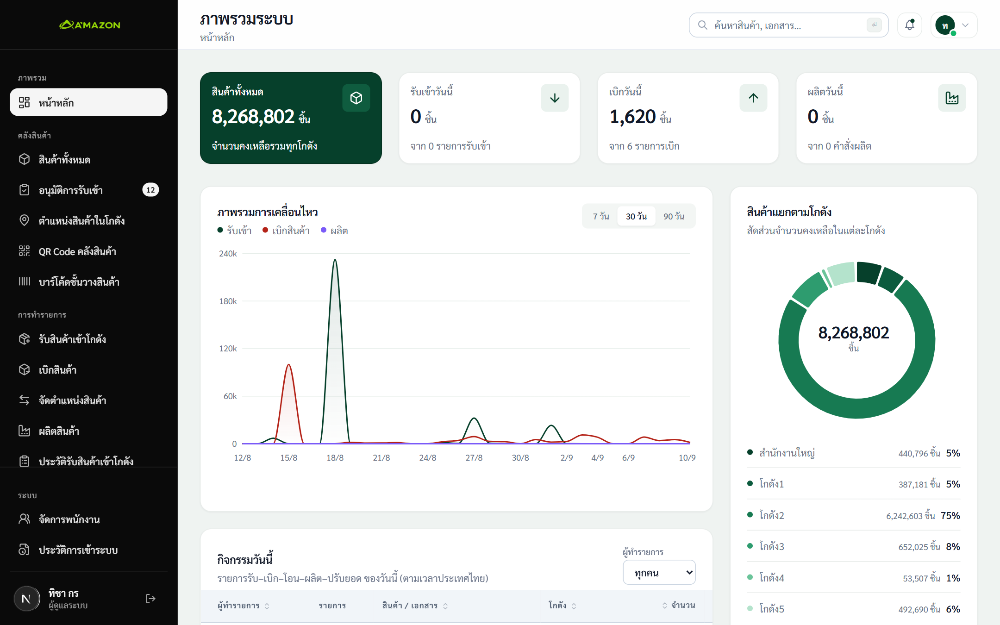
*ภาพที่ 2: หน้าแดชบอร์ดหลัก แสดงสถิติการเคลื่อนไหว ยอดสต็อกจริง (8,268,802 ชิ้น) และสถานะคลัง*

- ตรวจสอบยอดรวมสินค้า, รายการรออนุมัติรับเข้า (Pending RCV), รายการรอเบิก (Pending TRF)
- เลือกกรองดูข้อมูลแยกเฉพาะโกดัง (wh-01 ถึง wh-06) หรือภาพรวมทุกคลัง
- ดูกราฟความเคลื่อนไหวสินค้าเข้า-ออกรายสัปดาห์

---

## 3. [เมนูที่ 4] การอนุมัติและตรวจสอบใบรับสินค้า (Approvals - `/approvals`)

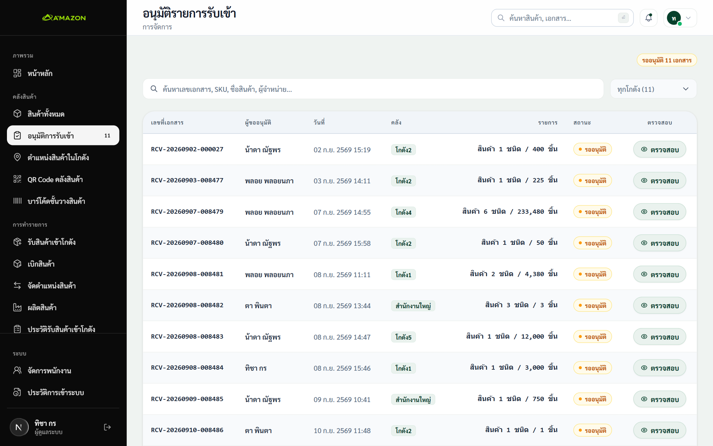
*ภาพที่ 3: รายการเอกสารรับเข้าสินค้าที่รอการตรวจสอบอนุมัติ (`/approvals`)*

1. เข้าเมนู **"อนุมัติการรับเข้า"** (`/approvals`)
2. คลิกปุ่ม **[ ตรวจสอบ ]** ที่รายการใบรับ (เช่น `RCV-20260908-0001`)
3. ตรวจสอบรายละเอียดสินค้า จำนวน และพิกัดชั้นวาง (เช่น `1K14-1A`)
4. คลิกปุ่ม **[ ✓ อนุมัติ ]** เพื่อให้ระบบอัปเดตยอดคงเหลือใน Google Sheets ทันที
5. หากตรวจพบข้อผิดพลาด สามารถคลิก **[ ✎ แก้ไขเอกสาร ]** หรือคลิก **[ ✕ ไม่อนุมัติ ]** เพื่อส่งกลับให้หน้างาน

---

## 4. [เมนูที่ 3] ประวัติรับสินค้าเข้าโกดัง (Receive History - `/movements/receive/history`)

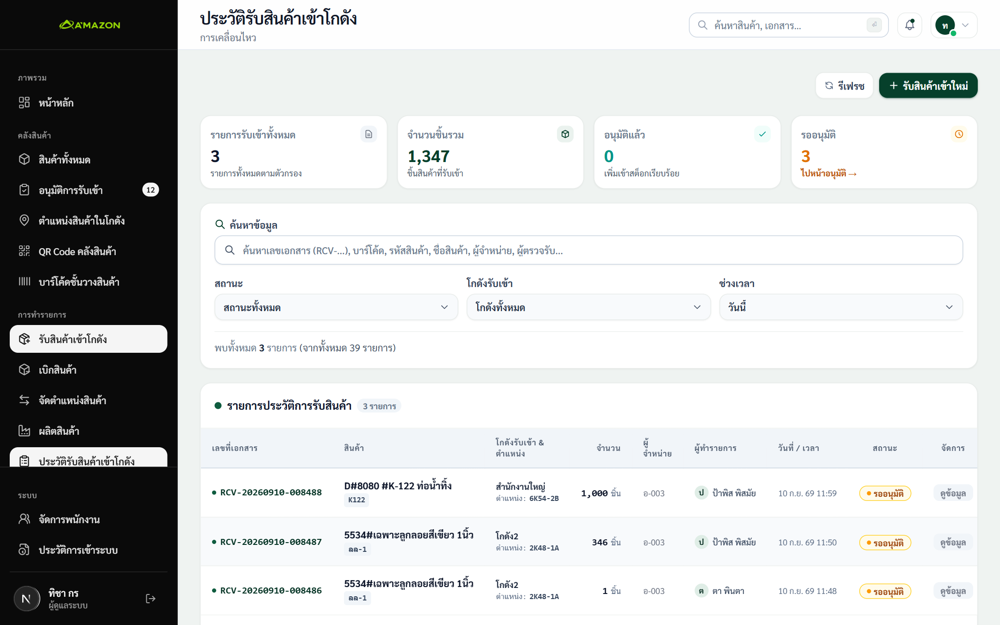
*ภาพที่ 4: หน้าจอประวัติรับสินค้าเข้าโกดังย้อนหลัง (`/movements/receive/history`)*

- ค้นหาเอกสารรับเข้าสินค้า RCV ย้อนหลังตามวันที่ หรือโกดังปลายทาง
- ตรวจสอบสถานะการอนุมัติ รายการสินค้า และชื่อพนักงานผู้รับสินค้าหน้างาน
- พิมพ์รายงานสรุปการรับสินค้าเข้าโกดัง

---

## 5. [เมนูที่ 5] การสร้างใบเบิกสินค้า (Transfer Request - `/movements/transfer`)

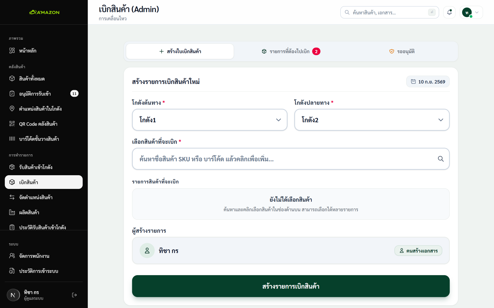
*ภาพที่ 5: หน้าจอการสร้างรายการเบิกสินค้าใหม่ของแอดมิน*

1. เข้าเมนู **"เบิกสินค้า"** เลือกแท็บ **"สร้างใบเบิกสินค้า"**
2. เลือก **โกดังต้นทาง** และ **โกดังปลายทาง**
3. ค้นหาสินค้า และระบุจำนวนที่ต้องการเบิก (ระบบจะแสดงยอดคงเหลือจริงเพื่อป้องกันการเบิกเกิน)
4. คลิกปุ่ม **[ สร้างรายการเบิกสินค้า ]** เพื่อส่งงานเข้าคิวของพนักงานคลังต้นทางทันที

---

## 6. [เมนูที่ 6] ประวัติเบิกสินค้า (Transfer History - `/movements/transfer/history`)

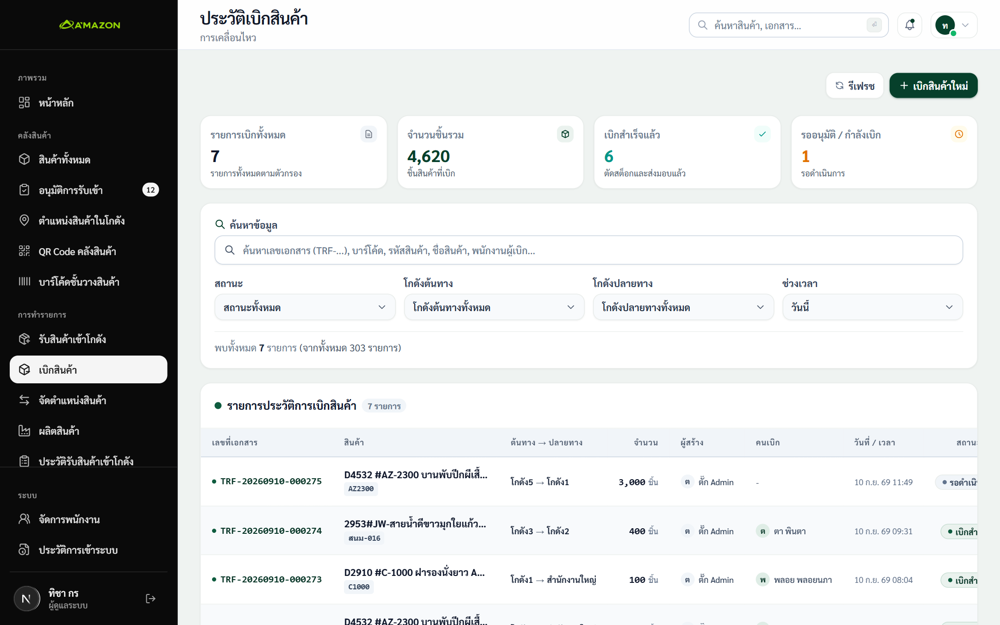
*ภาพที่ 6: หน้าจอประวัติการเบิกและโอนย้ายสินค้าระหว่างคลัง (`/movements/transfer/history`)*

- ตรวจสอบประวัติการโอนย้ายสินค้าระหว่างคลังทั้งหมด
- ตรวจสอบสถานะการดำเนินงานของแต่ละใบเบิก TRF (กำลังเบิก / รออนุมัติ / เสร็จสมบูรณ์)
- ตรวจสอบรายละเอียดสินค้า พิกัดต้นทาง และพิกัดปลายทางที่จัดเก็บ

---

## 7. [เมนูที่ 7] การจัดตำแหน่งสินค้าภายในคลัง (Move Location - `/movements/move`)

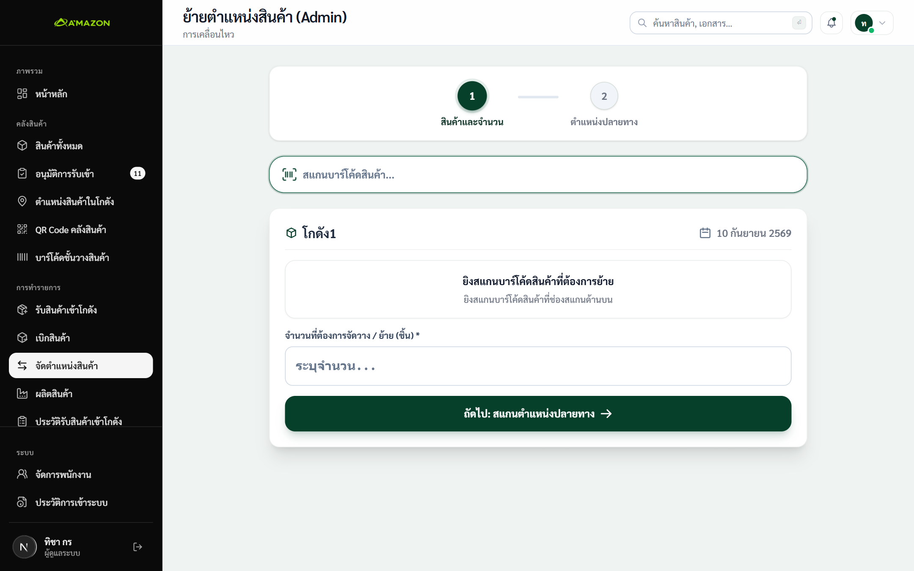
*ภาพที่ 7: หน้าจอจัดย้ายตำแหน่งสินค้าภายในโกดัง (`/movements/move`)*

- ระบุสินค้าและชั้นวางเดิมที่หยิบออก
- สแกนหรือระบุชั้นวางใหม่ปลายทาง พร้อมจำนวนชิ้น
- กดยืนยันเพื่ออัปเดตพิกัดชั้นวางในระบบทันที

---

## 8. [เมนูที่ 8] ตำแหน่งสินค้าในโกดัง (Locations Map - `/locations`)

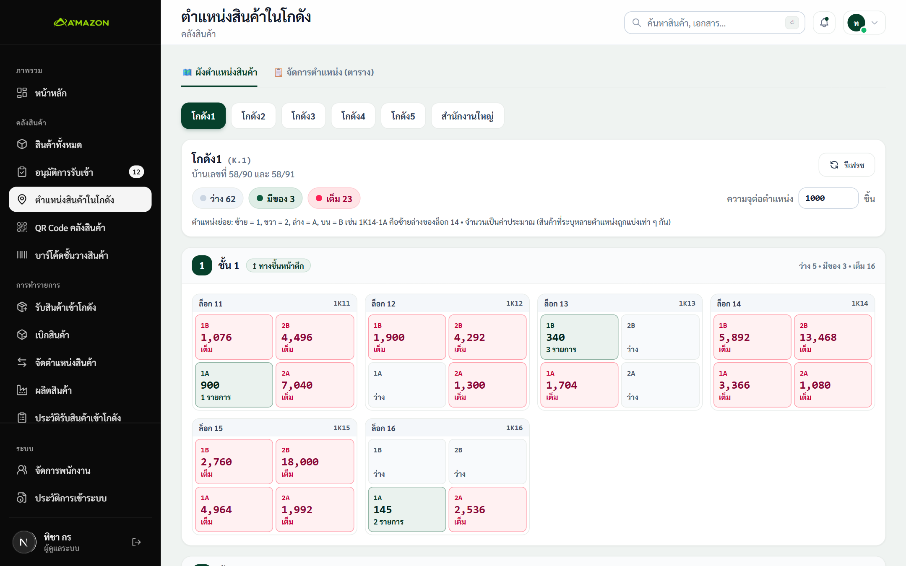
*ภาพที่ 8: แผนผังตำแหน่งชั้นวางสินค้าและความจุสต็อก (`/locations`)*

- ตรวจสอบแผนผังชั้นวางสินค้าในแต่ละโกดัง (wh-01 ถึง wh-06)
- ดูสถานะความจุของแต่ละชั้นวาง (ว่าง / มีสินค้า / เต็ม)
- ตรวจสอบรายการสินค้าและจำนวนชิ้นที่เก็บอยู่ในแต่ละพิกัด

---

## 9. [เมนูที่ 9] ประวัติการเคลื่อนไหวสินค้าทั้งหมด (Movements History - `/movements/history`)

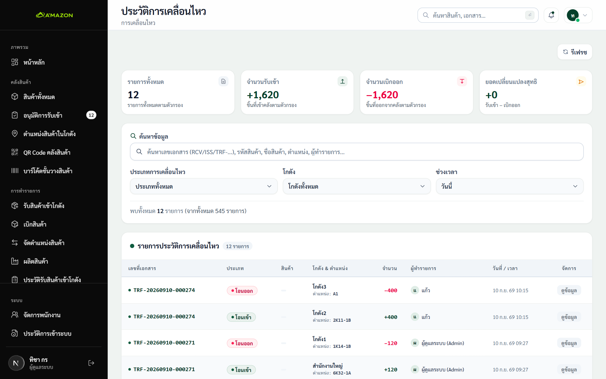
*ภาพที่ 9: ตารางประวัติการเคลื่อนไหวสินค้าทุกประเภทในระบบ (`/movements/history`)*

- ศูนย์รวมบันทึกธุรกรรม (Audit Trail) ครบทุกประเภท: RCV, TRF, MOV, OP, ADJ
- ค้นหาย้อนหลังตามรหัสสินค้า, วันที่, หรือผู้ปฏิบัติงาน
- แสดงยอดก่อนเคลื่อนไหว จำนวนที่เคลื่อนไหว และยอดคงเหลือสุทธิ

---

## 10. [เมนูที่ 10] การสั่งผลิตสินค้าตามสูตร BOM (Production - `/production`)

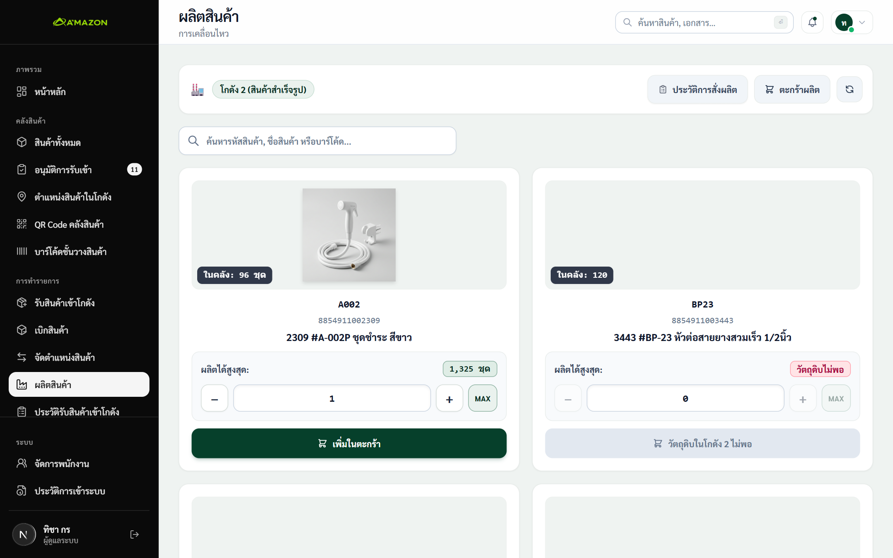
*ภาพที่ 10: หน้าจอสั่งผลิตสินค้าและคำนวณวัตถุดิบตามสูตร BOM (`/production`)*

1. เข้าเมนู **"สั่งผลิตสินค้า"** (`/production`)
2. เลือกสูตรการผลิต (BOM) ที่ต้องการประกอบ
3. ระบุจำนวนชุดที่ต้องการผลิต ระบบจะตรวจสอบสต็อกวัตถุดิบในโกดัง 2 โดยอัตโนมัติ
4. คลิกปุ่ม **[ สร้างคำสั่งผลิต ]** (`OP-...`) และเมื่อฝ่ายผลิตดำเนินการเสร็จสิ้น ให้กดยืนยันเพื่อตัดยอดวัตถุดิบและเพิ่มยอดสินค้าสำเร็จรูปเข้าคลัง

---

## 11. [เมนูที่ 11] ประวัติการสั่งผลิต (Production History - `/production/history`)

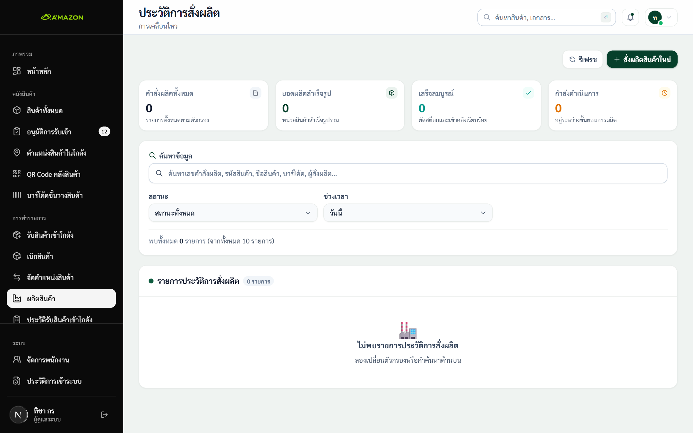
*ภาพที่ 11: หน้าจอประวัติคำสั่งผลิตและการตัดยอดวัตถุดิบ (`/production/history`)*

- ตรวจสอบคำสั่งผลิต OP ย้อนหลังตามวันที่และสินค้าสำเร็จรูป
- ตรวจสอบยอดวัตถุดิบที่ถูกตัดจ่ายจริงในแต่ละล็อตการผลิต
- ตรวจสอบสถานะคำสั่งผลิต (กำลังผลิต / ผลิตเสร็จสมบูรณ์)

---

## 12. [เมนูที่ 12] สินค้าทั้งหมดและตรวจสอบสต็อก (Products - `/products`)

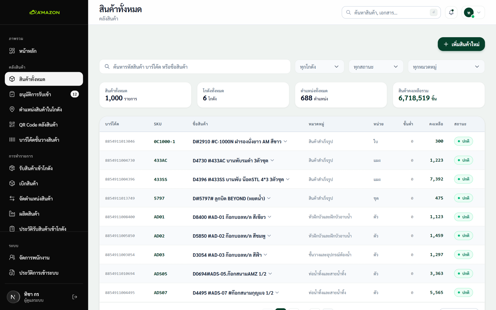
*ภาพที่ 12: หน้าจอสินค้าทั้งหมด แสดงยอดสต็อกแยกตามโกดังและสถานะสินค้า (`/products`)*

- ตรวจสอบยอดรวมสินค้า, โกดังทั้งหมด, และยอดคงเหลือรวม
- กรองตามโกดัง หมวดหมู่ และสถานะสต็อก (ปกติ, ต่ำกว่าขั้นต่ำ, สินค้าหมด)
- คลิก **[ + เพิ่มสินค้าใหม่ ]** เมื่อต้องการลงทะเบียนสินค้าใหม่เข้าสู่ระบบ

---

## 13. [เมนูที่ 13] การพิมพ์ QR Code ประจำคลังสินค้า (Warehouse QR - `/warehouses/qr`)

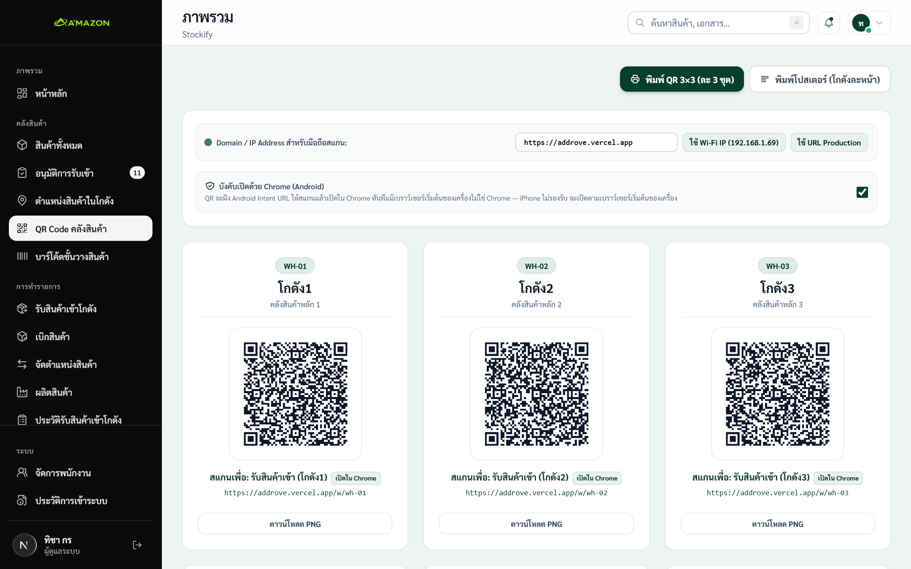
*ภาพที่ 13: หน้าจอสร้างและพิมพ์ QR Code ประจำโกดัง (`/warehouses/qr`)*

- เลือกรหัสโกดังที่ต้องการ
- คลิกปุ่ม **[ 🖨 พิมพ์โปสเตอร์ (โกดังละหน้า) ]** เพื่อพิมพ์ใส่กระดาษ A4 ติดหน้าประตูโกดังให้พนักงานสแกนเข้างาน

---

## 14. [เมนูที่ 14] การพิมพ์บาร์โค้ดชั้นวางสินค้า (Shelves Barcodes - `/shelves/qr`)

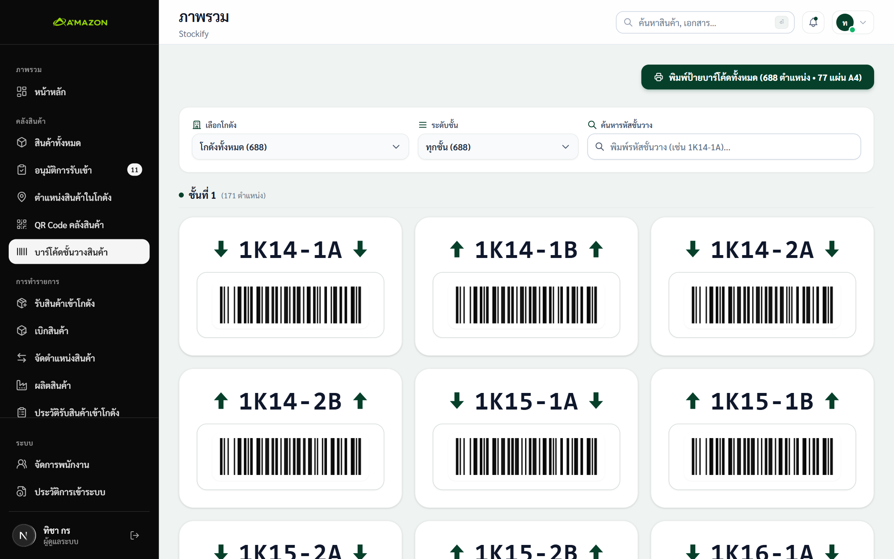
*ภาพที่ 14: หน้าจอสร้างแผ่นสติ๊กเกอร์บาร์โค้ดพิกัดชั้นวางสินค้า (`/shelves/qr`)*

- เลือกรหัสโกดังและโซนชั้นวางที่ต้องการพิมพ์
- คลิกปุ่ม **[ พิมพ์บาร์โค้ดชั้นวาง ]** เพื่อพิมพ์ลงบนกระดาษสติ๊กเกอร์ติดหน้าช่องจัดเก็บ

---

## 15. [เมนูที่ 15] รับสินค้า เข้า Express (`/express-import/receive`)

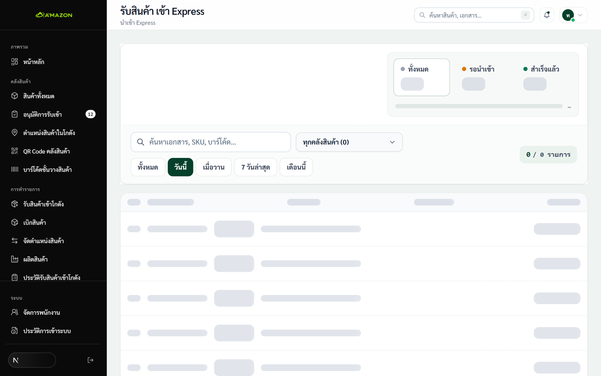
*ภาพที่ 15: หน้านำเข้าและตรวจเทียบเอกสารรับสินค้าเข้ากับ Express (`/express-import/receive`)*

- ดึงรายการรับเข้าสินค้า (RCV) ที่ได้รับอนุมัติแล้วมาเตรียมส่งเข้าโปรแกรมบัญชี Express
- ตรวจสอบความถูกต้องของรหัสสินค้าและจำนวน แล้วกด **[ นำเข้าและซิงก์ข้อมูลรับ ]**

---

## 16. [เมนูที่ 16] เบิกสินค้า เข้า Express (`/express-import/issue`)

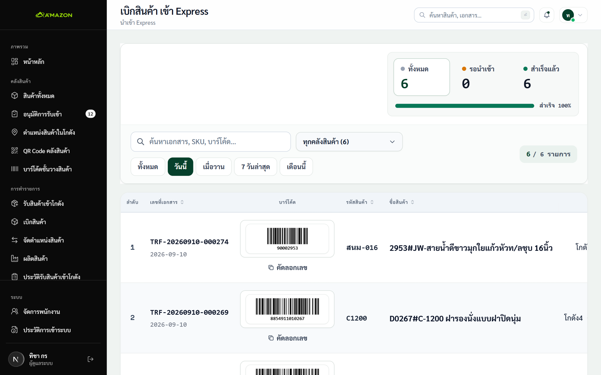
*ภาพที่ 16: หน้านำเข้าและตรวจเทียบเอกสารเบิกจ่ายสินค้าเข้ากับ Express (`/express-import/issue`)*

- ดึงรายการเบิกโอนย้ายสินค้า (TRF) มากระทบยอดตัดจ่ายต้นทุนใน Express
- ตรวจสอบความถูกต้องของโกดังตัดจ่าย แล้วกด **[ นำเข้าและซิงก์ข้อมูลเบิก ]**

---

## 17. [เมนูที่ 17] การจัดการผู้ใช้งานและกำหนดสิทธิ์ (Users Management - `/users`)

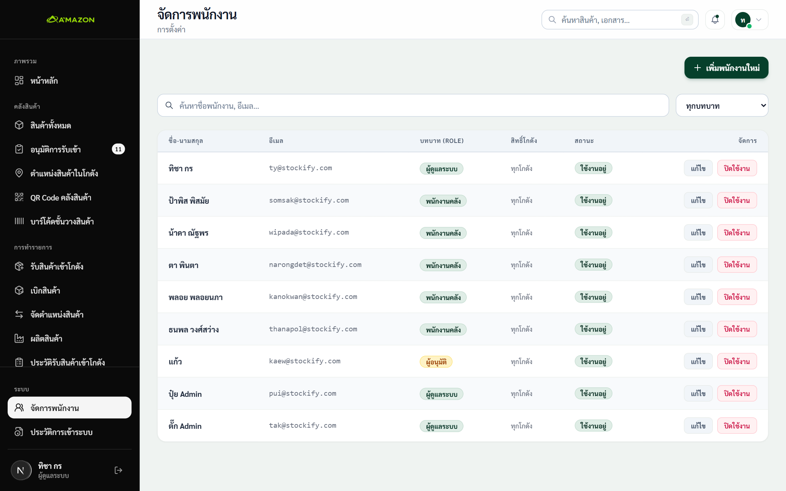
*ภาพที่ 17: หน้าจอบริหารจัดการผู้ใช้งานและกำหนดสิทธิ์บทบาท (`/users`)*

- คลิกปุ่ม **[ + เพิ่มผู้ใช้งานใหม่ ]** หรือคลิกแก้ไขรายชื่อพนักงาน
- กำหนดสิทธิ์บทบาท (`ADMIN`, `MANAGER`, `STAFF`), โกดังที่ประจำการ และตั้งรหัส PIN 4 หลัก

---

## 18. [เมนูที่ 18] การตรวจสอบประวัติการเข้าใช้งาน (Login Logs - `/login-logs`)

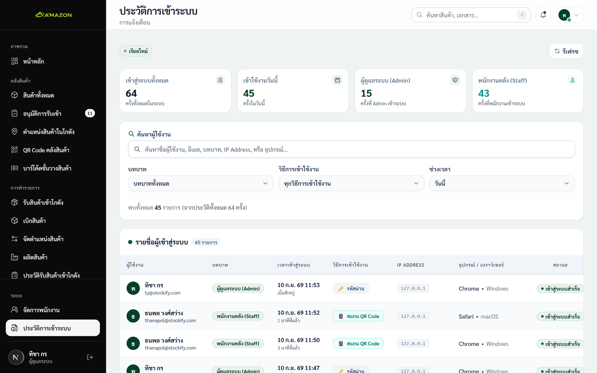
*ภาพที่ 18: ตารางประวัติการเข้าใช้งานระบบและความปลอดภัย (`/login-logs`)*

- ตรวจสอบวัน-เวลา, ชื่อผู้ใช้, โกดัง, ประเภทการล็อกอิน (`STAFF_PIN` หรือ `ADMIN_PASSWORD`), IP Address และสถานะผลลัพธ์
