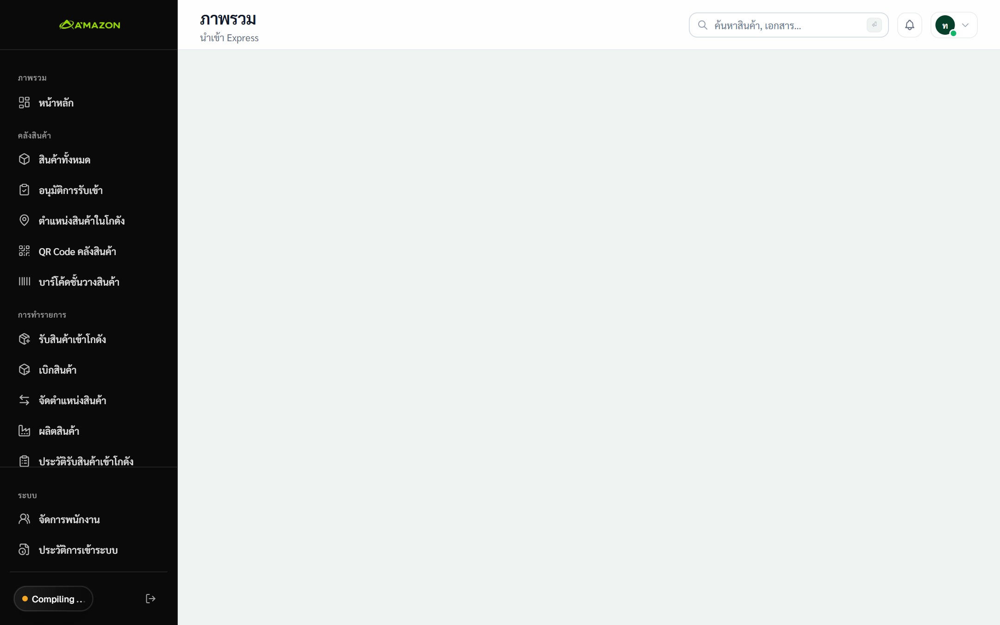

# คู่มือสำหรับผู้ดูแลระบบและผู้จัดการคลัง (Admin & Manager Guide)
### ระบบบริหารจัดการคลังสินค้า Stockify (ฉบับภาพหน้าจอจริง)

> **สำหรับบทบาท:** ผู้ดูแลระบบ (ADMIN) และ ผู้จัดการคลังสินค้า (MANAGER)  
> **อุปกรณ์:** คอมพิวเตอร์เดสก์ท็อป / แล็ปท็อป (ผ่าน Google Chrome / Edge)  
> **ภาพประกอบ:** ภาพถ่ายหน้าจอจริงจากการทำงานในระบบ Stockify

---

## 1. การเข้าสู่ระบบผู้ดูแลระบบ (Sign In)

*ภาพที่ 1: หน้าจอ Sign In ของผู้ดูแลระบบ (บัญชี `ty@stockify.com`)*

- เข้า URL ระบบที่หน้า `/login`
- กรอกข้อมูลบัญชีผู้ดูแลระบบ:
  - **Username / Email:** `ty@stockify.com`
  - **Password:** `tyty56tyty`
- คลิกปุ่ม **[ Sign In ]** เพื่อเข้าสู่ระบบ (เข้าสู่ระบบในชื่อ **คุณทิชา กร — ผู้ดูแลระบบ**)

---

## 2. หน้าแดชบอร์ดภาพรวมระบบ (Admin Dashboard)

*ภาพที่ 2: หน้าแดชบอร์ดหลัก แสดงสถิติการเคลื่อนไหว สต็อกสินค้า และสถานะคลัง*

- ตรวจสอบยอดรวมสินค้า, รายการรออนุมัติรับเข้า (Pending RCV), รายการรอเบิก (Pending TRF)
- เลือกกรองดูข้อมูลแยกเฉพาะโกดัง (wh-01 ถึง wh-06) หรือภาพรวมทุกคลัง
- ดูกราฟความเคลื่อนไหวสินค้าเข้า-ออกรายสัปดาห์

---

## 3. การอนุมัติและตรวจสอบใบรับสินค้า (Approvals)

*ภาพที่ 3: รายการเอกสารรับเข้าสินค้าที่รอการตรวจสอบอนุมัติ (`/approvals`)*

1. เข้าเมนู **"อนุมัติการรับเข้า"** (`/approvals`)
2. คลิกปุ่ม **[ ตรวจสอบ ]** ที่รายการใบรับ (เช่น `RCV-20260908-0001`)
3. ตรวจสอบรายละเอียดสินค้า จำนวน และพิกัดชั้นวาง (เช่น `1K14-1A`)
4. คลิกปุ่ม **[ ✓ อนุมัติ ]** เพื่อให้ระบบอัปเดตยอดคงเหลือใน Google Sheets ทันที
5. หากตรวจพบข้อผิดพลาด สามารถคลิก **[ ✎ แก้ไขเอกสาร ]** หรือคลิก **[ ✕ ไม่อนุมัติ ]** เพื่อส่งกลับให้หน้างาน

---

## 4. การสร้างใบเบิกสินค้า (Transfer Request)

*ภาพที่ 4: หน้าจอการสร้างรายการเบิกสินค้าใหม่ของแอดมิน*

1. เข้าเมนู **"เบิกสินค้า"** เลือกแท็บ **"สร้างใบเบิกสินค้า"**
2. เลือก **โกดังต้นทาง** และ **โกดังปลายทาง**
3. ค้นหาสินค้า และระบุจำนวนที่ต้องการเบิก (ระบบจะแสดงยอดคงเหลือจริงเพื่อป้องกันการเบิกเกิน)
4. คลิกปุ่ม **[ สร้างรายการเบิกสินค้า ]** เพื่อส่งงานเข้าคิวของพนักงานคลังต้นทางทันที

---

## 5. การสั่งผลิตและประกอบชุดสินค้า (Production & BOM)

*ภาพที่ 5: หน้าจอสั่งผลิตสินค้าและคำนวณวัตถุดิบตามสูตร BOM (`/production`)*

1. เข้าเมนู **"สั่งผลิตสินค้า"** (`/production`)
2. เลือกสูตรการผลิต (BOM) ที่ต้องการประกอบ
3. ระบุจำนวนชุดที่ต้องการผลิต ระบบจะตรวจสอบสต็อกวัตถุดิบในโกดัง 2 โดยอัตโนมัติ
4. คลิกปุ่ม **[ สร้างคำสั่งผลิต ]** (`OP-...`) และเมื่อฝ่ายผลิตดำเนินการเสร็จสิ้น ให้กดยืนยันเพื่อตัดยอดวัตถุดิบและเพิ่มยอดสินค้าสำเร็จรูปเข้าคลัง

---

## 6. การจัดการสินค้าและตรวจสอบสต็อก (Products)

*ภาพที่ 6: หน้าจอสินค้าทั้งหมด แสดงยอดสต็อกแยกตามโกดังและสถานะสินค้า*

- ตรวจสอบยอดรวมสินค้า, โกดังทั้งหมด, และยอดคงเหลือรวม
- กรองตามโกดัง หมวดหมู่ และสถานะสต็อก (ปกติ, ต่ำกว่าขั้นต่ำ, สินค้าหมด)
- คลิก **[ + เพิ่มสินค้าใหม่ ]** เมื่อต้องการลงทะเบียนสินค้าใหม่เข้าสู่ระบบ

---

## 7. การพิมพ์บาร์โค้ดชั้นวางสินค้า (Shelves Barcodes)

*ภาพที่ 7: หน้าจอสร้างแผ่นสติ๊กเกอร์บาร์โค้ดพิกัดชั้นวางสินค้า (`/shelves/qr`)*

- เลือกรหัสโกดังและโซนชั้นวางที่ต้องการพิมพ์
- คลิกปุ่ม **[ พิมพ์บาร์โค้ดชั้นวาง ]** เพื่อพิมพ์ลงบนกระดาษสติ๊กเกอร์ติดหน้าช่องจัดเก็บ

---

## 8. การพิมพ์ QR Code ประจำคลังสินค้า (Warehouse Entry QR)

*ภาพที่ 8: หน้าจอสร้างและพิมพ์ QR Code ประจำโกดัง (`/warehouses/qr`)*

- เลือกรหัสโกดังที่ต้องการ
- คลิกปุ่ม **[ 🖨 พิมพ์โปสเตอร์ (โกดังละหน้า) ]** เพื่อพิมพ์ใส่กระดาษ A4 ติดหน้าประตูโกดังให้พนักงานสแกนเข้างาน

---

## 9. การตรวจเทียบข้อมูลกับระบบ Express (Express Import)

*ภาพที่ 9: หน้าจอนำเข้าและตรวจเทียบข้อมูลกับระบบบัญชี Express (`/express-import`)*

- ดึงรายการบิลซื้อ/ขายจาก Express มาเทียบกับธุรกรรมใน Stockify
- ตรวจสอบความถูกต้องและกด **[ นำเข้าและซิงก์ข้อมูล ]**

---

## 10. การจัดการผู้ใช้งานและกำหนดสิทธิ์ (Users Management)

*ภาพที่ 10: หน้าจอบริหารจัดการผู้ใช้งานและกำหนดสิทธิ์บทบาท (`/users`)*

- คลิกปุ่ม **[ + เพิ่มผู้ใช้งานใหม่ ]** หรือคลิกแก้ไขรายชื่อพนักงาน
- กำหนดสิทธิ์บทบาท (`ADMIN`, `MANAGER`, `STAFF`), โกดังที่ประจำการ และตั้งรหัส PIN 4 หลัก

---

## 11. การตรวจสอบประวัติการเข้าใช้งาน (Login Logs & Audit Trail)

*ภาพที่ 11: ตารางประวัติการเข้าใช้งานระบบและความปลอดภัย (`/login-logs`)*

- ตรวจสอบวัน-เวลา, ชื่อผู้ใช้, โกดัง, ประเภทการล็อกอิน (`STAFF_PIN` หรือ `ADMIN_PASSWORD`), IP Address และสถานะผลลัพธ์
